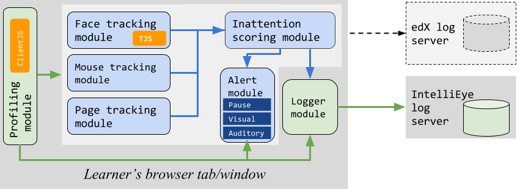
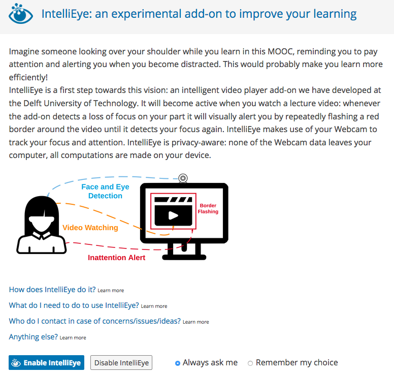
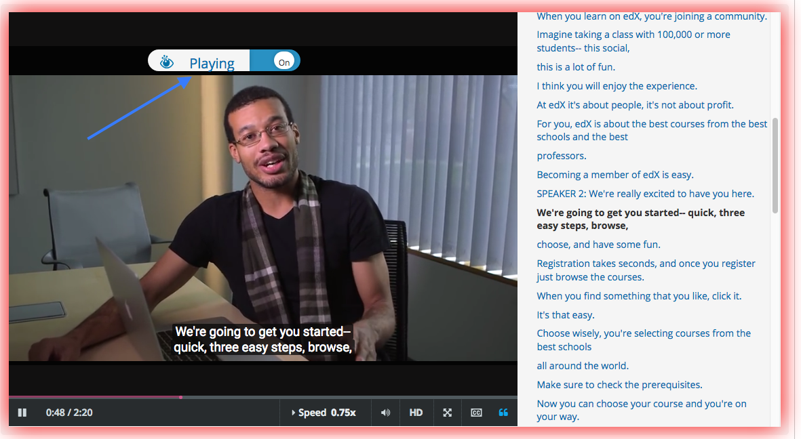

<style>
img{
    width: 60%;
    padding-left: 20%;
}
</style>

# IntelliEye: Enhancing MOOC Learners' Video Watching Experience through Real-Time Attention Tracking

## 1. Introduction

IntelliEye is a privacy-aware system that makes use of learners' Webcam feeds to determine -- in real-time -- when they no longer pay attention to the lecture videos. IntelliEye makes learners aware of their attention loss via visual and auditory cues.

## 2. Architecture

  
<center>Figure 1: IntelliEye's high-level architecture.</center>

### 2.1 Client side
As shown in Figure 1, IntelliEye has the profiling module, the inattention detection module, the alert module and the logger module. 

1. **Profiling Module**: In order to provide a smooth user experience for MOOC learners we limit the full usage of IntelliEye to devices that fulfill certain device setup requirements, a situation we call **supported setup**. We rely on the [ClientJS](https://github.com/jackspirou/clientjs) library to determine the device type, operating system and browser version of the learner's device and activate the inattention tracking modules only if a supported setup is detected.
2. **Inattention detection Module**: This module includes a face tracking module, a mouse tracking module, a page tracking module and a scoring module. Face tracking module is the main tracking module which detects whether learners are in front of the screen based on [tracking.js](https://trackingjs.com/). Mouse tracking module acts as a sanity check for the face tracking module: if the face tracking module reports loss of a face and the learner is still moving the mouse in the active MOOC window, we assume that the face tracking module misclassified the situation and do not raise an inattention alert. Page tracking module is used to track the visibility of the browser window or tab that contains the edX page. Based on the tracking array of these three tracking modules, the scoring module will decide whether raise an alert for learners inattention.
3. **Alert Module**: We explored three different mechanisms (discussed in section 3.2) ---with varying levels of disruption---to raise learners' awareness about their detected loss of attention; none of these requiring an action from the user beyond returning their attention to the video at hand. In our experiment each learner is assigned to a single alert type, depending on their edX user ID detected by the **Profiling module**.
4. **Logger Module**: This module is responsible for logging IntelliEye's usage. These logs are sent to our dedicated log server. Specifically, the following actions lead to logging: loading, video status change, IntelliEye status change, and inattention status change. *There is no video or image recorded from learners.*

### 2.2 Server side
On the server side, IntelliEye only has a log server which receives messages from the logger module on the client side and records them. There is no calculation running on the server side.

## 3. Interactions

### 3.1 Interface


<center>Figure 2: IntelliEye's welcome screen.</center>

As shown in Figure 2, learners with the suitable running environment will see the welcome page of IntelliEye before the video playing. In the welcome page, the motivation and the mechanism of IntelliEye are introduced to learners. Learners can choose to enable/disable IntelliEye for one time video watching or for all video watching. learners who choose to diable IntelliEye forever will be asked to provide a reason of their choice.


<center>Figure 3: IntelliEye's video player interface (arrow) embedded in the edX video player widget. The red hue around the video player is the visual alert we experiment with.</center>

In Figure 3, IntelliEye's video player interface is shown above the video playing area. On the left side, the status of IntelliEye is shown to learners. Learners can recall the welcome page by clicking the left side of the bar. On the right side, there is a switch button for enable/disable IntelliEye during video watching.

### 3.2 Alert

In IntelliEye, there are 3 types of reminding alert provided.

1. **Pausing**: When attention loss is detected IntelliEye will pause the currently playing lecture video. Once IntelliEye detects re-gained attention on the video, playing is resumed. At what position playing is resumed depends on **how long** the learner was not paying attention since pausing. The video is rewound to between 0 and 10 seconds before the attention loss was detected; we define three different configurations: (i) if the inattention period is less than 1.5 seconds, the video continues from where it was paused as it would be annoying for a learner to review content just seen and available in her short-time memory, but also to avoid repetitive 'rewind-and-play' situations; (ii) if the inattention lasted more than 10 seconds, the video is rewound 10 seconds which is the approximate lower level of human short-time memory (reported in between 10-30 seconds); and (iii) in all other cases it is rewound 3 seconds---rewind a little for rapid recall in case of distraction. This scheme ensures that the video will restart at a familiar point for the learner.
2. **Auditory alert**: In this setup, the video keeps playing but an additional sound effect (a bell ring) is played repeatedly as long as inattention is detected. This setup is not as "annoying" as falsely pausing the video, but can still substantially disturb the learner.
3. **Visual alert**: In this version, IntelliEye visually alerts the learner by repeatedly flashing a red border around the video as long as inattention is detected. Figure 3 shows an example of this alert. This scenario is the least intrusive in case IntelliEye falsely detects inattention. It may also be the least effective, as learners who look away from the screen or minimize the browser tab/window will not be able to view the alert.
 

## 4. Setup and maintenance 

### 4.1 Dependencies
#### 4.1.1 Nodejs
Used for running the server, runs javascript code without browser.

Install: depends on OS. Ubuntu: `sudo apt-get install nodejs`

---

#### 4.1.2 Npm 

Node package manager, needed to install nodejs and nodejs related packages.

Install: depends on OS. Ubuntu: `sudo apt-get install npm`

On Windows, installing Nodejs will also install Npm.

When inside the root of the app, enter npm install  to install the necessary node modules.

---

#### 4.1.3 pm2

Pm2 monitors the app and is able to run the app as a daemon process, no need for ‘screen’.

Install: npm install -g pm2

Usage: http://pm2.keymetrics.io/docs/usage/quick-start/#cheat-sheet
```
pm2 start app.js //starts app.js 
pm2 start app.js --name “myapp” //for easier recall later
pm2 stop <name app/all>
pm2 restart <name app> 
```

Restarting may not update client’s css, so stop all and starting the app should work.

---

#### 4.1.4 nginx

Is used as a reversed proxy (making the HTTP app HTTPS secure) and load balancer (serves static files like css, images, javascript).

Install: depends on OS. Ubuntu: `sudo apt-get install nginx`

Setup: depends on OS, config file’s location may be different.

For Ubuntu server:
copy ssl certificates to `/etc/nginx/ssl`
edit the default file: `sudo vi /etc/nginx/sites-available/default`

Make sure the default file contains the following:

```
server {
        listen 80 default_server;              #not necessary if not using HTTP
        listen  443 ssl default_server;        #necessary for HTTPS
        server_name     moocwidgets.cc;        #domain name
        root    /home/yuez/moocwidgets/; 

        ssl_certificate "/etc/nginx/ssl/cert.pem";
        ssl_certificate_key "/etc/nginx/ssl/key.key";

        include /etc/nginx/default.d/*.conf;

        location /static/ {     #location of static files (css, js, htmls)
                alias   /home/yuez/moocwidgets/static/; 
        }

        location / { 
                proxy_pass http://{Server IP}:8000;       #public IP of server:port defined in app.js
                proxy_http_version 1.1;
                proxy_set_header Upgrade $http_upgrade;
                proxy_set_header Connection 'upgrade';
                proxy_set_header Host $host;
                proxy_cache_bypass $http_upgrade;
        }

}
```

After saving the default file, restart nginx: `nginx -s reload`

---

#### 4.1.5 Gulp

Gulp is used to make the static files production ready i.e. concatenating files, minimizing files, transpile ES6 to ES5 and renaming files.

Install: `npm install -g gulp`
    (you also need to install local packages in the app root, this will be automatically done by entering `npm install`)

* Inside the root of the app, you will find the ‘gulpfile.js’. This file determines what needs to happen when using gulp. The file makes use of the gulp tasker to order certain actions. 

* First, ‘moocwidget-dev.js’ is transpiled from ES6 to ES5 for Internet Explorer compatibility. Then it is concatenated with ‘Client.js’ for environment retrieval.

* Then the 3 versions (Pause, AuditoryAlert, VisualAlert) of `ieyewidget.js` are compiled with the right HTML introduction contents.

**Before updating the server's static content, run `gulp` in the terminal when in the root of the app to perform these actions aboce**.

#### 4.1.6 Tracking.js

We use [the tracking.js library](https://trackingjs.com/) for face detection. It is already included in our system.

---

### 4.2 Workflow
* After editing Javascript files, run `gulp` in the terminal
* If necessary, commit the contents to the server
* Start or restart the app with pm2: `pm2 start app.js` or `pm2 restart <name>` (actual stop/start may be needed for CSS changes)

## 5. Contact
If you have any questions about IntelliEye, please contact Yue Zhao (y.zhao-1[at]tudelft.nl)

## References
1. Yue Zhao, Christoph Lofi, and Claudia Hauff. “Scalable Mind-Wandering Detection for MOOCs: A Webcam-Based Approach.” EC-TEL 2017.
2. Tarmo Robal, Yue Zhao, Christoph Lofi and Claudia Hauff. “Webcam-based attention tracking in Online Learning: A Feasibility Study”, IUI 2018.
3. Tarmo Robal, Yue Zhao, Christoph Lofi and Claudia Hauff. “IntelliEye: Enhancing MOOC Learners' Video Watching Experience through Real-Time Attention Tracking”, Hypertext 2018.

